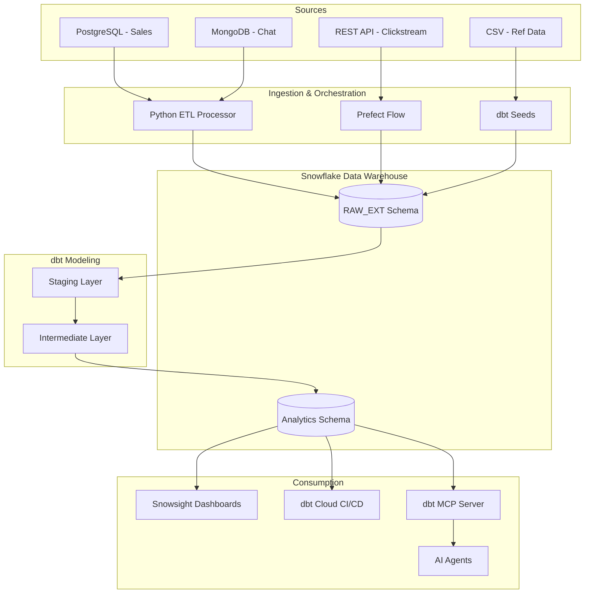

# Adventure Works Data Platform

An end-to-end data platform consolidating sales, customer, chat, and web analytics into a Snowflake warehouse. Features dbt-led transformations and a Model Context Protocol (MCP) server to enable programmatic data discovery for AI agents.

## Architecture

This diagram illustrates the flow from multi-modal ingestion (relational, document, and REST) through a transformation layer into a consumable AI-ready serving layer.



## Project Summary

Adventure Works faced a fragmented data landscape where sales, support, and marketing behavior lived in isolation.

I architected this platform to centralize PostgreSQL, MongoDB, and REST API data into a single Snowflake warehouse. Using Python for custom incremental extraction and dbt for dimensional modeling, the system cleans and joins across these sources to provide a complete view of the customer.

A unique differentiator for this platform is the implementation of an MCP server, which allows LLMs to autonomously discover and query documented models, reducing the friction between data engineering and AI-driven insights.

## Key Metrics

| Metric                 | Value                                                            |
| ---------------------- | ---------------------------------------------------------------- |
| Total Processed Volume | 68,365 Orders, 19,119 Customers, 1,185 Analytics Events          |
| Ingestion Latency      | ~7.2 seconds per microservice cycle                              |
| Model Surface Area     | 20 dbt models (Staging + Intermediate)                           |
| Data Quality           | 19 tests with 100% pass rate in CI/CD                            |
| Uptime & Reliability   | Integrated source freshness monitoring with 24h error thresholds |

## Tech Stack & Rationale

| Layer          | Technology       | Rationale                                                                                                                                      |
| -------------- | ---------------- | ---------------------------------------------------------------------------------------------------------------------------------------------- |
| Extraction     | Python & Prefect | Python allows for watermark-based incremental loading to minimize compute costs; Prefect handles retries and async scheduling for the REST API |
| Warehouse      | Snowflake        | Chosen for its separation of compute and storage and native support for MongoDB's semi-structured JSON via VARIANT columns                     |
| Transformation | dbt (Cloud/Core) | Provides version-controlled SQL, lineage tracking, and automated documentation necessary for professional-grade modeling                       |
| Agent Access   | dbt MCP Server   | Acts as a bridge for AI agents to interact with governed data models rather than raw, undocumented tables                                      |
| Reproduction   | Docker Compose   | Containerization ensures the full environment runs with a single command                                                                       |

## Data Quality & Testing

This project follows a "test-first" engineering philosophy.

- Unit & Integration Testing: Every model is protected by unique, not_null, and relationships tests
- Singular Business Tests: Custom SQL tests validate complex logic
- CI/CD Enforcement: dbt Cloud blocks pull requests if any test fails

## Setup and Run

### 1. Prerequisites

- Docker Desktop
- Python 3.9+
- A Snowflake account (trial credits are sufficient)
- uv for Python dependency management

### 2. Quick Start

```bash
git clone https://github.com/your-username/adventure-works-data-platform.git
cd adventure-works-data-platform

cp .env.sample .env

docker compose up -d

cd dbt
uv sync
uv run dbt build
```

## Design Decisions & Trade-offs

- Prefect vs Airflow: Selected for superior async handling and simpler local development
- Local Staging: Improves bulk ingestion cost efficiency

## AI Process Documentation

- Workflow: Used GitHub Copilot for scaffolding and models.yml generation
- Human Oversight: Designed schema and wrote 19 domain-specific tests manually
- Verification: Reviewed AI-generated SQL for correctness and optimization

## Future Improvements

- Incremental Materializations: Refactor staging models to reduce compute
